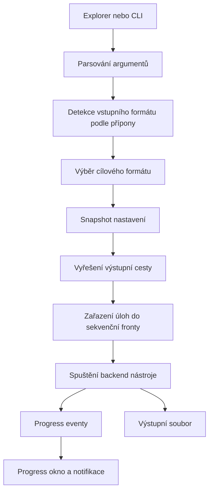

# Xolariq Wiki

Pokročilá wiki pro uživatele, správce i vývojáře Xolariq. Dokument popisuje chování aplikace, pracovní postupy, integraci do Windows, konverzní pipeline, nastavení, build, release a řešení problémů. Neobsahuje stromovou strukturu souborů repozitáře.

## Obsah

- [Co je Xolariq](#co-je-xolariq)
- [Základní principy](#základní-principy)
- [Podporované konverze](#podporované-konverze)
- [Uživatelské workflow](#uživatelské-workflow)
- [CLI a headless použití](#cli-a-headless-použití)
- [Konverzní pipeline](#konverzní-pipeline)
- [Nastavení a konfigurace](#nastavení-a-konfigurace)
- [Integrace do Windows Exploreru](#integrace-do-windows-exploreru)
- [Konverzní backendy](#konverzní-backendy)
- [Front-end a aplikační okna](#front-end-a-aplikační-okna)
- [Build a release](#build-a-release)
- [Vývojářská příručka](#vývojářská-příručka)
- [Testování a QA matice](#testování-a-qa-matice)
- [Troubleshooting](#troubleshooting)
- [Bezpečnost a soukromí](#bezpečnost-a-soukromí)
- [Roadmapa a rozšiřitelnost](#roadmapa-a-rozšiřitelnost)

## Co je Xolariq

Xolariq je Windows desktopová aplikace pro lokální konverzi souborů přímo z kontextového menu Průzkumníka. Uživatel vybere jeden nebo více souborů, klikne pravým tlačítkem, zvolí cílový formát a Xolariq spustí konverzi bez nahrávání dat do cloudu.

Aplikace je postavená na třech silných externích nástrojích:

| Oblast | Nástroj | Role |
| --- | --- | --- |
| Audio, video, obrázky | FFmpeg | Převod mediálních formátů, metadata, progres podle délky média |
| Dokumenty | pandoc | Převod textových a dokumentových formátů |
| Archivy | 7-Zip | Rozbalení a opětovné zabalení archivů |

Xolariq je záměrně „shell-first“: hlavní workflow běží z Exploreru, zatímco Settings a Progress okna jsou podpůrná.

## Základní principy

### Lokální zpracování

Soubory neopouštějí počítač uživatele. Xolariq nespouští cloudové konverze, nevyžaduje účet a nemá serverovou část.

### Minimální UI

Aplikace není klasický editor s hlavním oknem. UI existuje pro:

- sledování průběhu aktivní fronty,
- změnu nastavení,
- zapnutí nebo vypnutí shell integrace,
- zobrazení výsledku a chyb.

### Per-user instalace

Shell integrace se zapisuje do uživatelské části registru Windows. Běžné zapnutí kontextového menu proto nevyžaduje administrátorská práva.

### Sekvenční fronta

Při dávkové konverzi se úlohy zpracovávají postupně. To snižuje riziko zahlcení CPU/disku a dává uživateli jeden konzistentní progress stream.

### Sidecar-first distribuce

Release bundle má nést potřebné nástroje vedle aplikace. Vývojové prostředí může používat nástroje z `PATH` nebo z explicitně nastavené složky.

## Podporované konverze

Xolariq seskupuje formáty podle druhu souboru. Kontextové menu nabízí jen cíle ze stejné skupiny a vždy vynechá aktuální zdrojový formát, aby se nenabízela no-op konverze.

| Druh | Formáty | Backend | Důležité poznámky |
| --- | --- | --- | --- |
| Audio | `mp3`, `wav`, `flac`, `aac`, `ogg`, `opus` | FFmpeg | Metadata se při výchozím nastavení zachovávají, pokud to cílový kontejner podporuje. |
| Video | `mp4`, `mkv`, `webm`, `mov`, `avi`, `gif` | FFmpeg | GIF zahazuje audio a používá omezené FPS/scale, aby nevznikaly extrémně velké soubory. |
| Obrázky | `png`, `jpg`, `webp`, `avif`, `heic`, `ico` | FFmpeg | AVIF/HEIC závisí na kodecích dostupných ve zvolené FFmpeg distribuci. |
| Dokumenty | `pdf`, `docx`, `epub`, `txt`, `html`, `markdown` | pandoc | PDF výstup vyžaduje LaTeX nebo kompatibilní PDF engine; PDF vstup není podporovaný. |
| Archivy | `zip`, `7z`, `tar`, `gz`, `rar` | 7-Zip | RAR je pouze vstupní formát; výstup do RAR není podporovaný kvůli proprietárnímu `Rar.exe`. |

### Aliasy přípon

Detekce je založená na příponě a přijímá i běžné aliasy:

- `jpeg` → `jpg`
- `m4a` → `aac`
- `oga` → `ogg`
- `m4v` → `mp4`
- `qt` → `mov`
- `heif` → `heic`
- `htm` → `html`
- `md` / `markdown` → `markdown`
- `tgz` → `gz`

### Záměrná omezení

- Konverze mezi různými druhy souborů nejsou v nabídce, například video → audio nebo dokument → obrázek.
- PDF jako vstup není podporované přes pandoc.
- RAR jako výstup není podporovaný přes 7-Zip.
- Pokročilé profily enkódování nejsou v UI vystavené; Xolariq volí konzervativní defaulty.

## Uživatelské workflow

### Konverze jednoho souboru

1. Uživatel klikne pravým tlačítkem na podporovaný soubor.
2. Zvolí **Convert with Xolariq**.
3. Vybere cílový formát.
4. Otevře se progress okno.
5. Výsledný soubor se zapíše do cílové složky podle nastavení.
6. Po dokončení se zobrazí toast.

### Dávková konverze

1. Uživatel označí více souborů stejného nebo kompatibilního druhu.
2. Z kontextového menu vybere cílový formát.
3. Xolariq vytvoří jednu frontu.
4. Úlohy běží postupně.
5. Progress okno ukazuje aktuální položku, pořadí v dávce a celkový stav.
6. Po skončení dávky přijde souhrnná notifikace.

### Nastavení

Settings okno slouží pro:

- zapnutí/vypnutí kontextového menu,
- výběr výstupní složky,
- volbu chování při kolizi názvu,
- zapnutí/vypnutí zachování metadat,
- nastavení explicitních cest k FFmpeg, pandoc a 7-Zip.

### Výstupní soubory

Pokud není nastavena vlastní výstupní složka, výstup vzniká vedle vstupního souboru. Název se skládá z původního jména a cílové přípony.

Příklad:

```text
song.wav → song.mp3
photo.png → photo.webp
book.md → book.docx
```

Při kolizi názvu se výchozí režim chová bezpečně:

```text
song.mp3
song (1).mp3
song (2).mp3
```

## CLI a headless použití

Xolariq lze spouštět i mimo Explorer.

### Konverze z příkazové řádky

```powershell
xolariq.exe --target mp3 --input "C:\Users\me\Music\song.wav"
```

Více vstupů vytvoří dávku:

```powershell
xolariq.exe --target webp `
  --input "C:\Images\a.png" `
  --input "C:\Images\b.png"
```

### Headless režim

Headless režim je vhodný pro skripty a testy:

```powershell
xolariq.exe --headless --target zip --input "C:\Work\archive.7z"
```

V tomto režimu se UI nepoužívá jako hlavní feedback kanál; chyby mají být čitelné z konzole/logů.

### Shell integrace přes CLI

Registrace:

```powershell
xolariq.exe install-shell
```

Odregistrace:

```powershell
xolariq.exe uninstall-shell
```

Tyto příkazy jsou užitečné pro testování, CI smoke testy a administrátorské skripty.

## Konverzní pipeline

Konverze prochází několika jasnými kroky:



### Detekce formátu

Detekce je příponová. To je rychlé a bezpečné pro kontextové menu, protože Explorer nesmí při pravém kliknutí blokovat čtením obsahu velkých souborů.

### Snapshot nastavení

Každá úloha si při zařazení do fronty nese aktuální konverzní volby. Pokud uživatel změní nastavení během běžící dávky, nerozbije to rozpracované úlohy.

### Výstupní cesta

Pravidla:

1. Pokud je nastavená výstupní složka, použije se.
2. Jinak se zapisuje vedle vstupu.
3. Cílová přípona odpovídá vybranému formátu.
4. Kolize se řeší podle `output_mode`.

### Fronta a zrušení

Fronta je sekvenční. Aktivní úloha má cancel flag, který backendy pravidelně kontrolují. Při zrušení se:

- aktivní child proces ukončí,
- zbytek aktuální dávky se přeskočí,
- později přidané dávky zůstávají oddělené.

### Progress eventy

Progress stream používá jednotné události:

| Event | Význam |
| --- | --- |
| `QueueStarted` | Začala dávka s daným počtem úloh. |
| `JobStarted` | Začala konkrétní úloha. |
| `JobProgress` | Backend poslal procenta nebo neurčitý průběh. |
| `JobFinished` | Úloha skončila úspěšně. |
| `JobFailed` | Úloha skončila chybou. |
| `JobCancelled` | Úloha byla zrušena. |
| `QueueFinished` | Dávka skončila se souhrnem úspěchů/chyb. |

## Nastavení a konfigurace

Nastavení se ukládá jako JSON v uživatelské konfigurační složce aplikace. Neznámá pole jsou tolerovaná, aby budoucí verze mohla přidávat nové volby bez rozbití starších konfigurací.

| Nastavení | Výchozí hodnota | Popis |
| --- | --- | --- |
| `output_folder` | `null` | Vlastní výstupní složka; při `null` se zapisuje vedle vstupu. |
| `output_mode` | `rename` | `rename` chrání existující soubory, `overwrite` dovolí přepsání. |
| `preserve_metadata` | `true` | Zachová metadata, pokud to backend a cílový formát umí. |
| `context_menu_enabled` | `true` | Stav shell integrace z pohledu aplikace. |
| `ffmpeg_path` | `null` | Explicitní cesta k FFmpeg. |
| `pandoc_path` | `null` | Explicitní cesta k pandoc. |
| `seven_zip_path` | `null` | Explicitní cesta k 7-Zip/7za. |

### Priorita hledání nástrojů

Xolariq hledá externí nástroje v tomto pořadí:

1. explicitní cesta z nastavení,
2. složka v `XOLARIQ_TOOLS_DIR`,
3. sidecar vedle běžící aplikace,
4. běžný příkaz z `PATH`.

Tento model umožňuje stejnému buildu fungovat jako release bundle, portable instalace i vývojová verze.

### Logování

Proměnná `XOLARIQ_LOG` řídí úroveň logování:

```powershell
$env:XOLARIQ_LOG = "debug"
xolariq.exe --target mp3 --input "C:\Temp\song.wav"
```

Pro běžné uživatele je vhodné ponechat výchozí úroveň. Debug logy jsou primárně pro diagnostiku.

## Integrace do Windows Exploreru

Xolariq používá dvě vrstvy integrace:

| Vrstva | Kdy se používá | Výhody | Omezení |
| --- | --- | --- | --- |
| COM `IExplorerCommand` | Moderní Windows 11 kontextové menu | Zobrazení přímo v novém menu bez „Show more options“ | Vyžaduje registrovaný DLL handler. |
| Registry fallback | Windows 10, vývojové běhy, fallback scénáře | Jednodušší, per-user, bez admin práv | Na Windows 11 bývá pod „Show more options“. |

### Moderní Windows 11 menu

COM handler vystaví root položku **Convert with Xolariq** a pod ní cílové formáty. Handler běží v procesu Exploreru, proto musí být malý, rychlý a robustní. Jeho role je jen sesbírat vybrané cesty a spustit aplikaci.

### Registry fallback

Fallback registruje kaskádové verb položky pro podporované druhy souborů. Filtrace je založená na `AppliesTo` podmínkách:

- audio/video/obrázky/dokumenty přes `System.Kind`,
- archivy přes explicitní seznam přípon.

### Časté poznámky k Exploreru

- Po změně registrace může být potřeba restartovat Explorer.
- Na Windows 11 mohou klasické registry verb položky zůstat pod **Show more options**.
- `AppliesTo` závisí na Windows Search vlastnostech, proto může problém způsobit vypnutá služba Windows Search.
- Per-user registrace znamená, že každý Windows účet má vlastní stav integrace.

## Konverzní backendy

### FFmpeg: audio

Audio konverze používají konzervativní defaulty:

| Cíl | Strategie |
| --- | --- |
| MP3 | `libmp3lame`, kvalitativní VBR default |
| WAV | PCM 16-bit |
| FLAC | bezztrátový FLAC se střední kompresí |
| AAC | široce kompatibilní AAC bitrate |
| OGG | Vorbis kvalitativní režim |
| Opus | Opus s běžným bitrate |

Metadata se řídí nastavením `preserve_metadata`.

### FFmpeg: video

Video konverze preferují CPU-only kodeky, aby fungovaly bez GPU akcelerace:

| Cíl | Strategie |
| --- | --- |
| MP4/MKV/MOV | H.264 + AAC, kompatibilní default |
| WebM | VP9 + Opus |
| AVI | MPEG-4 + MP3 |
| GIF | bez audia, omezené FPS a šířka |

### FFmpeg: obrázky

Obrázkové konverze jsou většinou rychlé a nemají smysluplné procentuální měření. Progress proto může být neurčitý, dokud proces neskončí.

### pandoc: dokumenty

pandoc zpracovává textové a dokumentové formáty. PDF výstup je speciální, protože vyžaduje dostupný PDF engine. Pokud engine chybí, chyba pochází z pandoc a má být předaná uživateli.

### 7-Zip: archivy

Archivní konverze probíhá dvoufázově:

1. zdroj se rozbalí do dočasné pracovní složky,
2. rozbalený obsah se zabalí do cílového formátu.

Dočasná data se po úspěchu mažou best-effort. Pokud konverze spadne, může zůstat dočasná složka, což je užitečné pro diagnostiku.

## Front-end a aplikační okna

Xolariq používá jednoduchý Tauri front-end bez bundleru. Cílem je nízká komplexita a snadná údržba.

### Progress okno

Progress okno:

- přijímá `xolariq:progress` eventy,
- zobrazuje aktuální položku a průběh,
- umožňuje zrušit aktivní dávku,
- může otevřít Settings.

### Settings okno

Settings okno:

- načítá aktuální nastavení přes Tauri command,
- ukládá změny atomicky přes backend,
- používá nativní dialog pro výběr složky,
- zobrazuje stav shell integrace.

### Otevírání externích odkazů

Externí URL jsou omezené allow-listem. UI by nemělo posílat libovolné URL do shell openeru.

## Build a release

### Požadavky

Pro plný Windows build jsou potřeba:

- Rust stable,
- `rustfmt` a `clippy`,
- Microsoft C++ Build Tools,
- WebView2 runtime,
- Tauri CLI 2,
- FFmpeg, pandoc a 7-Zip pro runtime konverze.

### Vývojové ověření

```powershell
cargo test -p xolariq-core
cargo fmt --all -- --check
cargo clippy --workspace --all-targets -- -D warnings
```

### Lokální Tauri běh

```powershell
cargo tauri dev
```

První běh sestaví aplikaci a otevře Settings okno.

### Release bundle

```powershell
cargo tauri build
```

Release má obsahovat:

- hlavní `xolariq.exe`,
- installer pro MSI,
- installer pro NSIS,
- shell extension DLL, pokud se builduje moderní Windows integrace,
- sidecar nástroje s odpovídajícími licencemi.

### Sidecar nástroje

Sidecar binárky musí být pojmenované podle očekávání Tauri external binary mechanismu pro cílový triple. Pro Windows MSVC build to znamená suffix typu:

```text
ffmpeg-x86_64-pc-windows-msvc.exe
pandoc-x86_64-pc-windows-msvc.exe
7za-x86_64-pc-windows-msvc.exe
```

Licenční texty externích nástrojů musí být dodané vedle release artefaktů.

## Vývojářská příručka

### Přidání nového formátu

Checklist:

1. Přidat nový formát do centrálního enumu formátů.
2. Dodat kanonickou příponu a label.
3. Přidat detekci přípony a případné aliasy.
4. Zařadit formát do správného druhu souboru.
5. Upravit seznam cílů tak, aby nový formát byl dostupný v menu.
6. Naučit odpovídající backend nový formát produkovat nebo číst.
7. Pokud jde o shell extension, ověřit, že moderní submenu formát zná také.
8. Přidat nebo upravit testy pro detekci, roundtrip přípony a nabídku cílů.
9. Ověřit reálnou konverzi na Windows s příslušným externím nástrojem.

### Přidání nového backendu

Nový backend by měl dodržet stejný kontrakt jako stávající konvertory:

- přijmout vstup, výstup, zdrojový formát, cílový formát, možnosti a snapshot nastavení,
- podporovat cancellation,
- posílat progress callback,
- mapovat chyby externího nástroje na čitelnou chybu,
- neblokovat UI thread,
- nevyžadovat globální mutable stav.

### Zásady pro shell extension

COM handler běží uvnitř Exploreru. Platí proto přísnější pravidla:

- žádné dlouhé konverze uvnitř handleru,
- žádná síťová komunikace,
- minimální alokace a závislosti,
- chyby nepropagovat přes UI Exploreru, pokud pro ně není bezpečné místo,
- pouze sesbírat cesty a předat práci hlavní aplikaci.

### Zásady pro settings změny

Nové nastavení by mělo:

- mít bezpečný default,
- být tolerované při chybějícím nebo starším JSON poli,
- být serializovatelné přes serde,
- mít jasný UI label,
- neměnit chování již běžících úloh nečekaně.

### Zásady pro progress eventy

Progress eventy jsou veřejný kontrakt mezi backendem a UI. Při přidávání nových eventů je potřeba:

- zachovat kompatibilitu stávajících eventů,
- nepřetěžovat UI příliš častými aktualizacemi,
- rozlišovat chybu, zrušení a úspěch,
- u dávky vždy emitovat ukončovací souhrn.

## Testování a QA matice

### Automatické kontroly

| Kontrola | Příkaz | Účel |
| --- | --- | --- |
| Formátování | `cargo fmt --all -- --check` | Konzistentní Rust styl |
| Lint | `cargo clippy --workspace --all-targets -- -D warnings` | Statická kontrola a warning-free build |
| Unit testy | `cargo test` | Ověření core logiky a helperů |

### Ruční Windows smoke testy

| Scénář | Očekávání |
| --- | --- |
| Zapnutí integrace v Settings | Kontextové menu se registruje pro aktuálního uživatele. |
| Pravý klik na audio soubor | Menu nabídne audio cíle kromě zdrojového formátu. |
| Pravý klik na více souborů | Vznikne jedna dávka s postupným zpracováním. |
| Kolize názvu v rename režimu | Vznikne soubor s číslovaným suffixem. |
| Kolize názvu v overwrite režimu | Existující cílový soubor se nahradí. |
| Zrušení během konverze | Aktivní proces se ukončí a zbytek dávky se přeskočí. |
| Chybějící FFmpeg/pandoc/7-Zip | Uživatel dostane srozumitelnou chybu. |
| Windows 11 moderní menu | COM položka se objeví bez „Show more options“, pokud je DLL registrovaná. |
| Registry fallback | Položka funguje pod klasickým menu. |

### Doporučená sada reálných souborů

- krátký WAV a MP3,
- krátké MP4,
- PNG a JPG,
- Markdown dokument,
- ZIP archiv,
- soubor s mezerami a diakritikou v názvu,
- soubor ve velmi dlouhé cestě,
- více souborů najednou.

## Troubleshooting

| Problém | Pravděpodobná příčina | Doporučený postup |
| --- | --- | --- |
| `failed to spawn ffmpeg` | FFmpeg není dostupný. | Nastavit cestu ve Settings, použít `XOLARIQ_TOOLS_DIR`, nebo nainstalovat FFmpeg do `PATH`. |
| `pandoc` selže při PDF výstupu | Chybí LaTeX/PDF engine. | Nainstalovat MiKTeX nebo zvolit jiný cílový formát. |
| HEIC/AVIF selže | FFmpeg build nemá potřebný kodek. | Ověřit `ffmpeg -encoders` a použít build s `libheif`/`libaom`. |
| Menu není vidět na Windows 11 | Používá se registry fallback. | Zkontrolovat registraci COM handleru nebo použít **Show more options**. |
| Menu se po zapnutí nezměnilo | Explorer cachuje stav. | Restartovat Explorer. |
| Archivní konverze selže | 7-Zip neumí cílový formát nebo nejde zapsat výstup. | Ověřit dostupnost 7-Zip a práva k cílové složce. |
| Výstup je jinde, než uživatel čekal | Je nastavená vlastní výstupní složka. | Zkontrolovat Settings a případně resetovat výstupní složku. |
| Konverze je pomalá | CPU-only enkódování, velký vstup, pomalý disk. | Ověřit velikost vstupu, zvolit lehčí cílový formát nebo počkat na dokončení. |
| `AppliesTo` filtr nefunguje | Windows Search vlastnosti nejsou dostupné. | Ověřit službu Windows Search a asociace přípon. |

## Bezpečnost a soukromí

### Soukromí

Xolariq zpracovává soubory lokálně. Neodesílá obsah souborů ani metadata na vzdálený server.

### Důvěra v externí nástroje

FFmpeg, pandoc a 7-Zip jsou silné nástroje, které parsují komplexní formáty. Release proces musí hlídat:

- důvěryhodný zdroj binárek,
- kontrolu verzí,
- přiložené licence,
- možnost rychle aktualizovat při bezpečnostním advisory.

### Práce s cestami

Konverze musí bezpečně zacházet s:

- mezerami v cestách,
- Unicode znaky,
- dlouhými cestami,
- názvy začínajícími pomlčkou,
- kolizemi názvů,
- právy k cílové složce.

### Shell extension

Protože shell extension běží v Exploreru, nesmí dělat těžkou práci ani otevírat složité závislosti. Bezpečný model je předat vybrané soubory hlavní aplikaci a hned skončit.

### Reportování zranitelností

Bezpečnostní chyby se nemají hlásit veřejným issue. Postup je popsaný v `SECURITY.md`.

## Roadmapa a rozšiřitelnost

Možné směry dalšího vývoje:

- profily kvality pro audio/video,
- volitelná GPU akcelerace,
- lepší PDF vstup přes samostatný reader,
- pokročilejší log viewer v Settings,
- export/import nastavení,
- detailnější progress pro archivy,
- validace dostupnosti backend nástrojů přímo v UI,
- automatický diagnostický report pro bug reporty,
- lokalizace UI,
- rozšíření ruční Windows test matice.

Každé rozšíření by mělo zachovat hlavní charakter Xolariq: rychlé pravé kliknutí, lokální konverze, minimum překážek a bezpečné defaulty.
